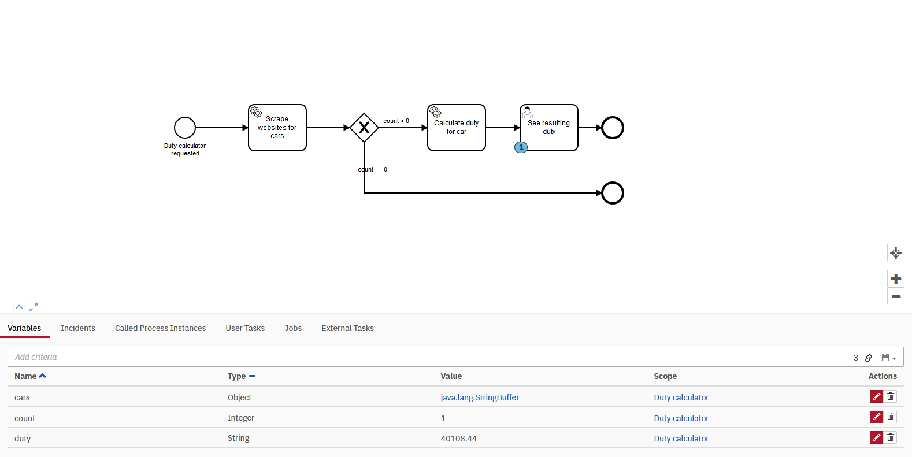

# Assignment 6

## _Mini Project BPMN_

This project consists of a small business process resembling the tasks implemented by our React frontend. [See dutycal.surge.sh](http://dutycal.surge.sh)

Our business process must scrape several websites for used car and calculate the duty to be paid when importing it.\
We have modeled this process using Camunda modeler. In our model we have added a condition that must be met before a duty is calculated, ie. we must have some cars that match the criteria.\
If our REST service yields some cars, we call our SOAP service to calculate the duty.\
\
The REST service scraping modules can be further split up so each scraper can be called in isolation, this might be a better candidate for a Camunda process. However, since this assignment relies heavily on Camunda, it can be seen as a feasibilty test to be further elaborated.

Neither the REST nor the SOAP service is hosted. If you want to try it out, do the following:
1. Clone the repo.
2. Run the SOAP service on localhost:8080 (done automagically).
3. Run the REST service on localhost:8081 (done automagically).
4. Install Camunda Docker image with the following command:\
<code>docker pull camunda/camunda-bpm-platform:latest</code>
5. Run the Camunda service on localhost:8082 via Docker with this command:\
<code>docker run -d --name camunda -p 8082:8080 camunda/camunda-bpm-platform:latest</code>
6. Open the resources/scrape.bpmn with the Camunda modeler.
7. Deploy it to Camunda.
8. Login at localhost:8082/camunda (demo/demo)
9. Go to task list -> Start process and choose Duty Calculator.
10. Go to cockpit and verify the duty as seen below.

